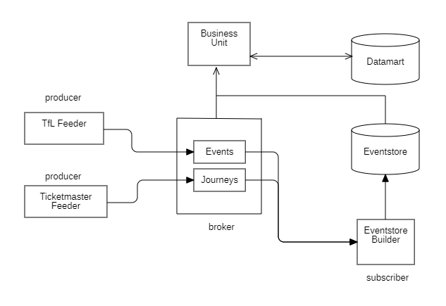
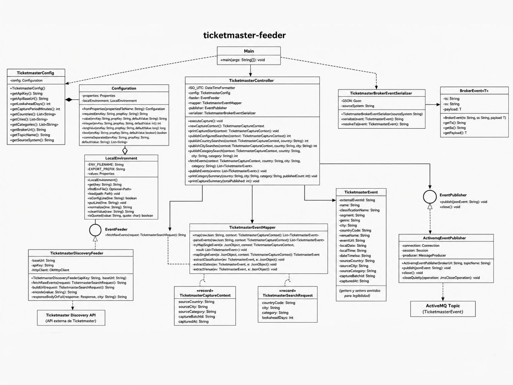
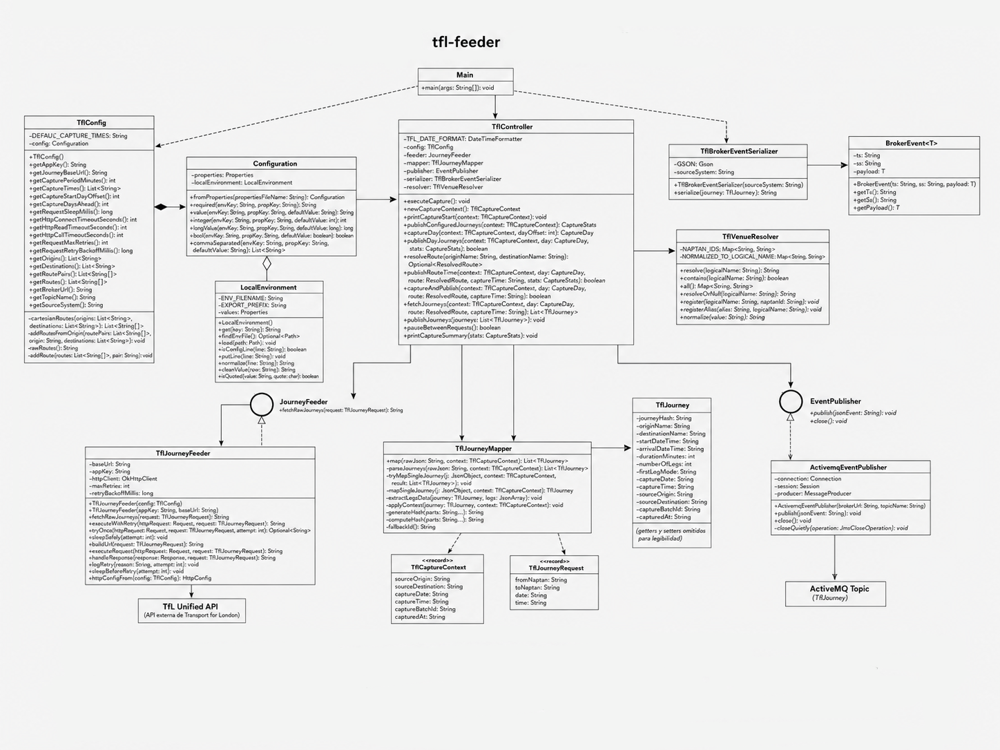
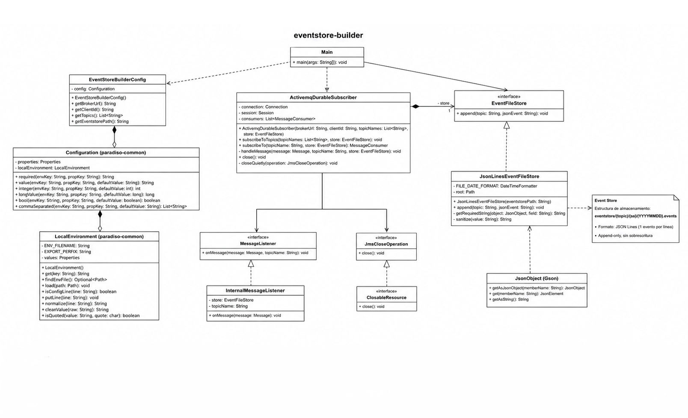
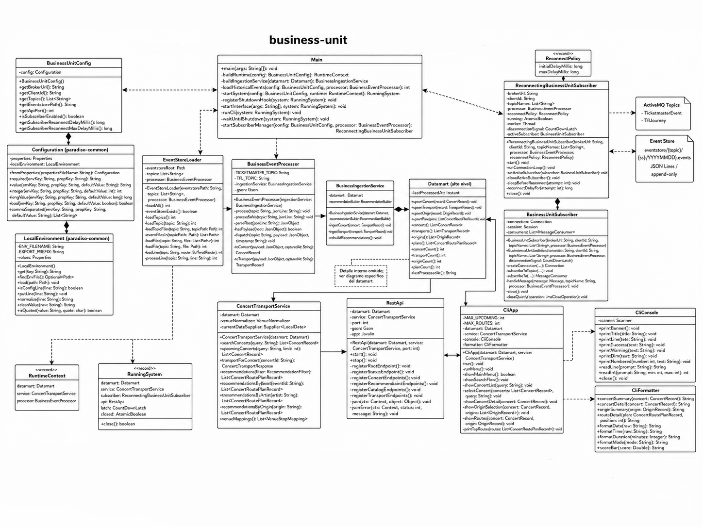
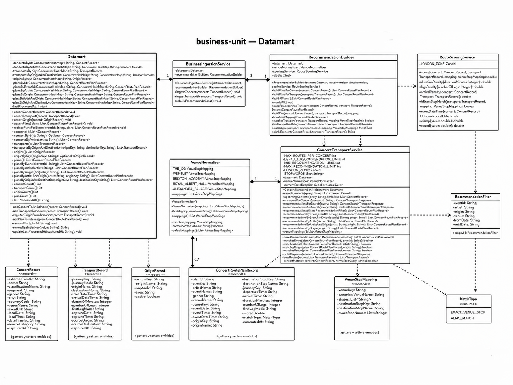

# Paradiso

**Paradiso** es una aplicación **Java 21 multimódulo** que integra eventos musicales de Londres con rutas de transporte público de Transport for London. El sistema captura datos desde fuentes externas, los publica como eventos en ActiveMQ, los conserva en un Event Store histórico y los explota desde una unidad de negocio que ofrece recomendaciones de rutas hacia conciertos mediante **API REST** y **CLI interactiva**.

El proyecto ha sido desarrollado para la asignatura **Desarrollo de Aplicaciones para Ciencia de Datos** de la Universidad de Las Palmas de Gran Canaria.

---

## Índice

1. [Propuesta de valor](#propuesta-de-valor)
2. [Funcionalidades principales](#funcionalidades-principales)
3. [Arquitectura del sistema](#arquitectura-del-sistema)
4. [Diagramas de clases y arquitectura](#diagramas-de-clases-y-arquitectura)
5. [Módulos del proyecto](#módulos-del-proyecto)
6. [Justificación de fuentes externas y datamart](#justificación-de-fuentes-externas-y-datamart)
7. [Formato de eventos y Event Store](#formato-de-eventos-y-event-store)
8. [Configuración](#configuración)
9. [Compilación](#compilación)
10. [Ejecución](#ejecución)
11. [CLI interactiva](#cli-interactiva)
12. [API REST](#api-rest)
13. [Datos generados de ejemplo](#datos-generados-de-ejemplo)
14. [Tests y validación](#tests-y-validación)
15. [Principios y patrones de diseño](#principios-y-patrones-de-diseño)
16. [Estructura del repositorio](#estructura-del-repositorio)
17. [Evolución por sprints](#evolución-por-sprints)

---

## Propuesta de valor

Paradiso permite planificar la asistencia a conciertos en Londres combinando dos dimensiones que normalmente se consultan por separado: la oferta musical disponible y las rutas de transporte público hacia los recintos donde se celebran los eventos.

El sistema construye un **datamart de recomendaciones** que relaciona conciertos, recintos, estaciones de origen y rutas TfL compatibles. A partir de esa información, el usuario puede consultar próximos conciertos, buscar eventos por texto, seleccionar un origen de salida y obtener rutas recomendadas con duración, modo de transporte, hora de salida, hora de llegada y puntuación.

La propuesta de valor se centra en transformar datos externos heterogéneos en una vista de negocio orientada al usuario final. Paradiso permite responder preguntas como:

- qué conciertos están disponibles próximamente en Londres;
- desde qué orígenes de transporte se puede planificar una salida;
- qué rutas existen hacia un recinto concreto;
- qué recomendaciones están disponibles para un concierto determinado;
- qué rutas son más convenientes según duración, número de tramos y proximidad al recinto.

---

## Funcionalidades principales

- Captura de eventos musicales mediante `ticketmaster-feeder`.
- Captura de rutas de transporte público mediante `tfl-feeder`.
- Publicación de eventos JSON en ActiveMQ mediante topics independientes.
- Persistencia histórica append-only mediante `eventstore-builder`.
- Organización del Event Store por topic, fuente y fecha.
- Reconstrucción del datamart desde eventos históricos.
- Consumo opcional en tiempo real desde ActiveMQ.
- Generación de recomendaciones precalculadas entre conciertos y rutas.
- Consulta mediante API REST.
- Consulta mediante CLI interactiva.
- Configuración privada mediante variables de entorno, `.env` o ficheros `.properties` locales ignorados por Git.
- Pruebas automatizadas por módulo.

---

## Arquitectura del sistema

Paradiso sigue una arquitectura modular orientada a eventos. Los feeders capturan información externa, la transforman en modelos internos y publican eventos en ActiveMQ. El módulo `eventstore-builder` consume esos eventos y los conserva como histórico en formato JSON Lines. El módulo `business-unit` carga el histórico, mantiene un datamart en memoria y expone la funcionalidad final al usuario mediante API REST y CLI.



La arquitectura final se aproxima a una **Kappa simplificada**: tanto los eventos históricos como los eventos recibidos en tiempo real son procesados por la misma lógica de negocio. El histórico inicializa el datamart y el consumo real-time permite mantenerlo actualizado durante la ejecución.

Flujo general:

```text
Ticketmaster API ──> ticketmaster-feeder ──┐
                                           ├──> ActiveMQ ──> eventstore-builder ──> Event Store
TfL Unified API ──> tfl-feeder ────────────┘                       │
                                                                    │
                                                                    ▼
                                                           business-unit
                                                           ├── Datamart
                                                           ├── REST API
                                                           └── CLI interactiva
```

---

## Diagramas de clases y arquitectura

Los diagramas se incluyen como imágenes PNG en `docs/diagrams/`. Están organizados por módulo para mantener la legibilidad y reflejar la separación real del proyecto.

### `ticketmaster-feeder`



El módulo `ticketmaster-feeder` captura eventos musicales desde Ticketmaster y los publica como eventos JSON en ActiveMQ. `Main` actúa como punto de entrada y construye la configuración, el feeder HTTP, el mapper, el serializador y el publicador JMS. `TicketmasterController` coordina la captura por país, ciudad y categoría. `TicketmasterDiscoveryFeeder` encapsula la conexión HTTP con la fuente externa, `TicketmasterEventMapper` transforma el JSON recibido en `TicketmasterEvent` y `TicketmasterBrokerEventSerializer` genera el evento común `{ ts, ss, payload }` antes de publicarlo mediante `ActivemqEventPublisher`.

### `tfl-feeder`



El módulo `tfl-feeder` captura itinerarios de transporte público entre orígenes y destinos configurados. `TflController` coordina la captura por días, horarios y pares origen-destino. `TflVenueResolver` traduce nombres lógicos a identificadores de parada, `TflJourneyFeeder` consulta la fuente externa, `TflJourneyMapper` transforma el JSON recibido en `TflJourney` y `TflBrokerEventSerializer` publica los viajes como eventos en el topic `TflJourney`.

### `eventstore-builder`



El módulo `eventstore-builder` utiliza un subscriber durable para consumir eventos desde ActiveMQ y persistirlos en el Event Store. `ActivemqDurableSubscriber` gestiona la conexión JMS y la suscripción a los topics configurados. `JsonLinesEventFileStore` implementa la escritura append-only en ficheros `.events`, resolviendo la ruta a partir de `topic`, `ss` y la fecha derivada de `ts`.

### `business-unit`



El módulo `business-unit` orquesta la carga histórica, el consumo en tiempo real y la exposición de consultas. `Main` construye el runtime de la unidad de negocio, `EventStoreLoader` carga eventos históricos, `BusinessEventProcessor` convierte eventos JSON en records de negocio, `BusinessIngestionService` actualiza el datamart y `ReconnectingBusinessUnitSubscriber` mantiene el consumo real-time cuando está habilitado. La salida al usuario se ofrece mediante `RestApi` y `CliApp`.

### Datamart y recomendaciones



El datamart representa el núcleo de negocio de `business-unit`. `Datamart` mantiene índices en memoria para conciertos, rutas, orígenes y planes recomendados. `RecommendationBuilder` genera `ConcertRoutePlanRecord` relacionando conciertos con rutas compatibles, `VenueNormalizer` normaliza recintos y destinos TfL, `RouteScoringService` calcula la puntuación de cada ruta y `ConcertTransportService` expone búsquedas y recomendaciones a la API REST y la CLI.

---

## Módulos del proyecto

| Módulo | Responsabilidad | Patrón principal | Topics |
|---|---|---|---|
| `common` | Infraestructura compartida de configuración local, variables de entorno y `.properties`. | Shared Kernel técnico | — |
| `ticketmaster-feeder` | Captura eventos musicales, los transforma y los publica. | Adapter + Mapper + Publisher | `TicketmasterEvent` |
| `tfl-feeder` | Captura rutas TfL para orígenes y destinos configurados. | Adapter + Mapper + Publisher | `TflJourney` |
| `eventstore-builder` | Consume eventos y los almacena en ficheros históricos. | Durable Subscriber + Event Store | `TicketmasterEvent`, `TflJourney` |
| `business-unit` | Reconstruye el datamart y ofrece recomendaciones al usuario. | Datamart + Service Layer + REST/CLI | `TicketmasterEvent`, `TflJourney` |

---

## Justificación de fuentes externas y datamart

### Ticketmaster

Ticketmaster se utiliza como fuente de eventos porque proporciona información adecuada para el caso de uso de Paradiso:

- identificador externo del evento;
- nombre del concierto o artista;
- fecha y hora;
- ciudad y país;
- recinto;
- género o clasificación;
- referencia pública del evento cuando está disponible en la respuesta externa.

Es una fuente dinámica porque el catálogo de eventos cambia con el tiempo. Cada captura se transforma en eventos propios del sistema, con timestamp y fuente de origen, para conservar su evolución en el Event Store.

### Transport for London

Transport for London se utiliza como fuente de rutas porque permite obtener itinerarios de transporte público dentro del mismo ámbito geográfico que los eventos: Londres.

El feeder de TfL trabaja con un catálogo controlado de orígenes y destinos. Esta decisión reduce capturas innecesarias, evita combinaciones masivas y centra la información en rutas útiles para los recintos musicales contemplados por el proyecto.

La fuente sigue siendo dinámica porque cada ejecución consulta la API externa para fechas y horas configuradas. Los resultados pueden variar por horarios, disponibilidad del servicio, incidencias o cambios operativos.

### Compatibilidad entre fuentes

La combinación de ambas fuentes es coherente porque Ticketmaster aporta el evento y su recinto, mientras que TfL aporta la movilidad hacia puntos cercanos a esos recintos. El sistema normaliza venues y destinos mediante catálogos internos de correspondencia para generar recomendaciones comparables.

### Diseño del datamart

El datamart de `business-unit` está implementado en memoria y se reconstruye desde el Event Store al arrancar. Esta decisión es adecuada porque el Event Store actúa como fuente histórica persistente y permite recomponer el estado de negocio cuando sea necesario.

Modelos principales:

| Modelo | Descripción |
|---|---|
| `ConcertRecord` | Vista de negocio de un evento musical. |
| `TransportRecord` | Vista de negocio de una ruta TfL. |
| `OriginRecord` | Origen de transporte disponible para consultas. |
| `ConcertRoutePlanRecord` | Recomendación precalculada entre concierto, origen y ruta. |

El datamart mantiene índices por evento, origen, artista, recinto y combinaciones relevantes para que las consultas REST y CLI no tengan que recalcular todas las relaciones en cada petición.

---

## Formato de eventos y Event Store

Los feeders publican mensajes JSON con una estructura común:

```json
{
  "ts": "2026-05-20T09:00:00Z",
  "ss": "ticketmaster-feeder",
  "payload": {
    "...": "..."
  }
}
```

| Campo | Descripción |
|---|---|
| `ts` | Timestamp UTC asociado al dato. |
| `ss` | Identificador del sistema productor. |
| `payload` | Datos propios del evento producido por cada feeder. |

El Event Store se organiza siguiendo la estructura:

```text
eventstore/{topic}/{ss}/{YYYYMMDD}.events
```

Cada fichero `.events` usa formato JSON Lines:

- un evento JSON completo por línea;
- escritura en modo append;
- sin sobrescribir capturas previas;
- separación temporal por fecha calculada a partir de `ts`.

Ejemplo de estructura generada:

```text
eventstore/TicketmasterEvent/ticketmaster-feeder/20260520.events
eventstore/TflJourney/tfl-feeder/20260520.events
```

---

## Configuración

La configuración privada no se versiona. El repositorio incluye plantillas seguras para documentar las variables y propiedades necesarias.

Prioridad de configuración:

```text
variables de entorno reales
        ↓
.env local
        ↓
ficheros .properties locales
        ↓
valores por defecto seguros
```

La resolución de configuración se centraliza en el módulo `common`, mediante `Configuration` y `LocalEnvironment`. Las claves reales, URLs base externas y parámetros locales no se escriben en las clases Java.

### Ficheros versionados

| Fichero | Propósito |
|---|---|
| `.env.example` | Plantilla general de variables de entorno. |
| `ticketmaster-feeder/src/main/resources/ticketmaster.properties.example` | Plantilla local para `ticketmaster-feeder`. |
| `tfl-feeder/src/main/resources/tfl.properties.example` | Plantilla local para `tfl-feeder`. |
| `eventstore-builder/src/main/resources/eventstore-builder.properties.example` | Plantilla local para `eventstore-builder`. |
| `business-unit/src/main/resources/business-unit.properties.example` | Plantilla local para `business-unit`. |

### Ficheros no versionados

| Fichero | Motivo |
|---|---|
| `.env` | Contiene valores locales de ejecución. |
| `ticketmaster.properties` | Puede contener clave o configuración privada. |
| `tfl.properties` | Puede contener clave o configuración privada. |
| `eventstore-builder.properties` | Configuración local del Event Store. |
| `business-unit.properties` | Configuración local del datamart, API y subscriber. |

### Variables principales

| Variable | Uso |
|---|---|
| `PARADISO_BROKER_URL` | Dirección del broker ActiveMQ. |
| `PARADISO_EVENTSTORE_PATH` | Ruta del Event Store. |
| `PARADISO_API_PORT` | Puerto de la API REST. |
| `PARADISO_SUBSCRIBER_ENABLED` | Activa o desactiva consumo real-time en `business-unit`. |
| `PARADISO_TICKETMASTER_API_KEY` | Clave local de Ticketmaster. |
| `PARADISO_TICKETMASTER_API_BASE_URL` | URL base externa de Ticketmaster. |
| `PARADISO_TFL_APP_KEY` | Clave local de TfL. |
| `PARADISO_TFL_JOURNEY_BASE_URL` | URL base externa de TfL Journey Planner. |
| `PARADISO_TFL_ORIGINS` | Orígenes lógicos usados por `tfl-feeder`. |
| `PARADISO_TFL_DESTINATIONS` | Destinos lógicos usados por `tfl-feeder`. |

### Ejemplo mínimo de `.env`

```env
PARADISO_BROKER_URL=<broker-url>

PARADISO_TICKETMASTER_API_KEY=<ticketmaster-api-key>
PARADISO_TICKETMASTER_API_BASE_URL=<ticketmaster-base-url>
PARADISO_TICKETMASTER_COUNTRIES=GB
PARADISO_TICKETMASTER_CITIES=London
PARADISO_TICKETMASTER_CATEGORIES=music,festival
PARADISO_TICKETMASTER_LOOKAHEAD_DAYS=60
PARADISO_TICKETMASTER_CAPTURE_PERIOD_MINUTES=60
PARADISO_TICKETMASTER_TOPIC=TicketmasterEvent
PARADISO_TICKETMASTER_SOURCE_SYSTEM=ticketmaster-feeder

PARADISO_TFL_APP_KEY=<tfl-app-key>
PARADISO_TFL_JOURNEY_BASE_URL=<tfl-journey-base-url>
PARADISO_TFL_ORIGINS=KingsCross,Victoria,Waterloo,Paddington,LondonBridge
PARADISO_TFL_DESTINATIONS=O2Arena,WembleyPark,BrixtonAcademy,RoyalAlbertHall,AlexandraPalace
PARADISO_TFL_CAPTURE_TIMES=1530,1600,1630,1700,1730,1800,1815,1830,1845,1900,1915,1930,1945,2000,2030
PARADISO_TFL_CAPTURE_START_DAY_OFFSET=0
PARADISO_TFL_CAPTURE_DAYS_AHEAD=10
PARADISO_TFL_REQUEST_SLEEP_MS=150
PARADISO_TFL_HTTP_CONNECT_TIMEOUT_SECONDS=10
PARADISO_TFL_HTTP_READ_TIMEOUT_SECONDS=45
PARADISO_TFL_HTTP_CALL_TIMEOUT_SECONDS=60
PARADISO_TFL_REQUEST_MAX_RETRIES=2
PARADISO_TFL_REQUEST_RETRY_BACKOFF_MS=1000
PARADISO_TFL_CAPTURE_PERIOD_MINUTES=90
PARADISO_TFL_TOPIC=TflJourney
PARADISO_TFL_SOURCE_SYSTEM=tfl-feeder

PARADISO_EVENTSTORE_BUILDER_CLIENT_ID=paradiso-eventstore-builder
PARADISO_EVENTSTORE_BUILDER_TOPICS=TicketmasterEvent,TflJourney

PARADISO_CLIENT_ID=paradiso-business-unit
PARADISO_TOPICS=TicketmasterEvent,TflJourney
PARADISO_EVENTSTORE_PATH=eventstore
PARADISO_API_PORT=7000
PARADISO_SUBSCRIBER_ENABLED=false
PARADISO_RECONNECT_DELAY_MS=5000
PARADISO_RECONNECT_MAX_DELAY_MS=30000
```

La plantilla completa se encuentra en `.env.example`. Los ficheros `.properties.example` permiten configurar los módulos de forma independiente si se prefiere no usar `.env`.

---

## Compilación

Desde la raíz del repositorio:

```bash
mvn clean package
```

Compilar un módulo concreto junto con sus dependencias:

```bash
mvn -pl business-unit -am package
```

Ejecutar todos los tests:

```bash
mvn test
```

---

## Ejecución

ActiveMQ debe estar disponible antes de ejecutar los módulos que publican o consumen eventos en tiempo real. La dirección del broker se define mediante `PARADISO_BROKER_URL` o la propiedad `broker.url` del módulo correspondiente.

### 1. Event Store Builder

```bash
java -jar eventstore-builder/target/eventstore-builder-1.0-SNAPSHOT.jar
```

El módulo queda suscrito a los topics configurados y escribe eventos en la ruta definida para el Event Store.

### 2. Ticketmaster Feeder

Ejecución única:

```bash
java -jar ticketmaster-feeder/target/ticketmaster-feeder-1.0-SNAPSHOT.jar --once
```

Ejecución periódica:

```bash
java -jar ticketmaster-feeder/target/ticketmaster-feeder-1.0-SNAPSHOT.jar
```

### 3. TfL Feeder

Ejecución única:

```bash
java -jar tfl-feeder/target/tfl-feeder-1.0-SNAPSHOT.jar --once
```

Ejecución periódica:

```bash
java -jar tfl-feeder/target/tfl-feeder-1.0-SNAPSHOT.jar
```

### 4. Business Unit

Modo API REST:

```bash
java -jar business-unit/target/business-unit-1.0-SNAPSHOT.jar
```

Modo CLI interactiva:

```bash
java -jar business-unit/target/business-unit-1.0-SNAPSHOT.jar --cli
```

En modo CLI, la API REST también queda disponible mientras la consola interactiva está activa.

### Consideraciones sobre la ruta del Event Store

Si los módulos se ejecutan desde la raíz del repositorio, la ruta habitual es:

```env
PARADISO_EVENTSTORE_PATH=eventstore
```

Si un módulo se ejecuta con un directorio de trabajo distinto, la ruta puede ajustarse en `.env`, en el `.properties` local o mediante una ruta absoluta.

---

## CLI interactiva

La CLI permite consultar el datamart desde consola sin utilizar herramientas externas. Está integrada en `business-unit` y se activa con el argumento `--cli`.

Funcionalidades disponibles:

1. Ver próximos conciertos en Londres.
2. Buscar conciertos por artista, recinto o nombre.
3. Seleccionar un concierto.
4. Seleccionar un origen TfL.
5. Consultar rutas recomendadas cuando existan planes precalculados.

Ejemplo de flujo:

```text
Paradiso — Planificador de conciertos

[1] Ver próximos conciertos en Londres
[2] Buscar conciertos por artista, recinto o nombre
[3] Salir

Elige una opción: 1
```

La CLI utiliza el mismo datamart que la API REST. Por tanto, los resultados dependen de los eventos históricos cargados y de los eventos recibidos en tiempo real si el subscriber está activado.

---

## API REST

La API REST expone el datamart y las recomendaciones de la unidad de negocio.

### Endpoints principales

| Método | Endpoint | Descripción |
|---|---|---|
| GET | `/` | Información general de la API. |
| GET | `/status` | Estado del datamart. |
| GET | `/concerts` | Conciertos disponibles. |
| GET | `/concerts?query={texto}` | Búsqueda de conciertos por texto. |
| GET | `/concerts/upcoming` | Próximos conciertos. |
| GET | `/concerts/upcoming?query={texto}&limit={n}` | Próximos conciertos filtrados y limitados. |
| GET | `/concerts/{id}` | Detalle de un concierto. |
| GET | `/concerts/{id}/routes` | Rutas recomendadas para un concierto. |
| GET | `/concerts/{id}/routes?origin={origin}` | Rutas para un concierto desde un origen. |
| GET | `/recommendations` | Recomendaciones disponibles. |
| GET | `/recommendations?page={page}&size={size}` | Recomendaciones paginadas. |
| GET | `/recommendations?eventId={id}&artist={artist}&origin={origin}&venue={venue}&fromDate={yyyy-mm-dd}&untilDate={yyyy-mm-dd}` | Recomendaciones filtradas. |
| GET | `/artists/{artist}/recommendations` | Recomendaciones por artista. |
| GET | `/artists/{artist}/recommendations?origin={origin}&venue={venue}` | Recomendaciones por artista con filtros adicionales. |
| GET | `/origins` | Orígenes TfL cargados. |
| GET | `/venues` | Recintos normalizados y destinos asociados. |
| GET | `/transport` | Rutas TfL cargadas. |

Endpoints mantenidos por compatibilidad:

| Método | Endpoint | Descripción |
|---|---|---|
| GET | `/concerts/{id}/transport` | Consulta legacy de transporte por concierto. |
| GET | `/recommendations/{id}` | Consulta legacy de recomendaciones por concierto. |

### Ejemplos de consultas

```bash
curl -s "http://localhost:7000/status"
curl -s "http://localhost:7000/concerts/upcoming?limit=5"
curl -s "http://localhost:7000/origins"
curl -s "http://localhost:7000/venues"
curl -s "http://localhost:7000/recommendations?page=0&size=5"
```

### Ejemplo de estado del datamart

```json
{
  "concerts": 2,
  "transports": 2,
  "origins": 2,
  "routePlans": 2,
  "lastProcessedAt": "2026-05-20T09:05:00Z"
}
```

### Ejemplo de recomendación

```json
{
  "eventId": "tm-joe-rah-20260506",
  "artistName": "Joe Bonamassa",
  "eventName": "Joe Bonamassa",
  "venueName": "Royal Albert Hall",
  "originName": "Paddington Underground Station",
  "destinationStopName": "High Street Kensington",
  "departureTime": "2026-05-06T19:00:00",
  "arrivalTime": "2026-05-06T19:12:00",
  "durationMinutes": 12,
  "numberOfLegs": 1,
  "firstLegMode": "tube",
  "score": 1.0,
  "matchType": "EXACT_VENUE_STOP"
}
```

---

## Datos generados de ejemplo

El repositorio incluye muestras reducidas en `docs/samples/`. Estas muestras documentan el formato de los datos generados sin versionar capturas completas ni información privada.

```text
docs/samples/
├── eventstore/
│   ├── TicketmasterEvent/
│   │   └── ticketmaster-feeder/
│   │       └── sample.events
│   └── TflJourney/
│       └── tfl-feeder/
│           └── sample.events
└── datamart/
    ├── status.json
    ├── concerts.json
    ├── transport.json
    ├── origins.json
    ├── venues.json
    └── recommendations.json
```

Las muestras del Event Store mantienen el formato JSON Lines. Las muestras del datamart representan respuestas de la API REST tras procesar eventos históricos y construir recomendaciones.

---

## Tests y validación

Ejecutar todos los tests:

```bash
mvn test
```

Ejecutar tests por módulo junto con sus dependencias:

```bash
mvn -pl ticketmaster-feeder -am test
mvn -pl tfl-feeder -am test
mvn -pl eventstore-builder -am test
mvn -pl business-unit -am test
```

Aspectos cubiertos por los tests:

- serialización de eventos con `ts`, `ss` y `payload`;
- mapeo desde respuestas externas a modelos internos;
- escritura append-only del Event Store;
- lectura histórica desde ficheros `.events`;
- reconstrucción del datamart;
- normalización de recintos;
- generación de recomendaciones;
- scoring de rutas;
- endpoints REST principales.

---

## Principios y patrones de diseño

### Separación de responsabilidades

Cada módulo separa consumo, transformación, publicación, persistencia, carga histórica y consulta. Esta división facilita pruebas, mantenimiento y evolución.

### Publisher/Subscriber

Los feeders publican eventos en topics independientes y los consumidores se suscriben a ellos. Esta estrategia desacopla productores y consumidores.

### Durable Subscriber

`eventstore-builder` utiliza suscripción durable para conservar eventos no consumidos durante interrupciones temporales.

### Event Store

Los eventos se almacenan como fuente histórica append-only. El sistema conserva capturas pasadas y permite reconstruir vistas de negocio.

### Datamart

`business-unit` mantiene una vista optimizada de consulta para evitar recalcular recomendaciones en cada petición.

### Materialized View

Las recomendaciones `ConcertRoutePlanRecord` actúan como vista materializada entre conciertos, recintos, orígenes y rutas.

### Service Layer

La lógica de negocio queda encapsulada en servicios. La API REST y la CLI consumen esos servicios sin acceder directamente a detalles de ingestión o procesamiento.

### Adapter y Mapper

Los feeders aíslan las fuentes externas mediante clientes y transforman las respuestas a modelos internos antes de publicarlas.

### Configuración externa

Las claves, URLs base y parámetros de ejecución se mantienen fuera del código fuente. El módulo `common` centraliza la resolución de configuración para evitar duplicidad entre módulos.

---

## Estructura del repositorio

```text
paradiso/
├── pom.xml
├── README.md
├── .env.example
├── common/
│   └── src/main/java/org/ulpgc/paradiso/common/
├── ticketmaster-feeder/
│   └── src/main/java/org/ulpgc/paradiso/ticketmaster/
├── tfl-feeder/
│   └── src/main/java/org/ulpgc/paradiso/tfl/
├── eventstore-builder/
│   └── src/main/java/org/ulpgc/paradiso/eventstorebuilder/
├── business-unit/
│   └── src/main/java/org/ulpgc/paradiso/businessunit/
│       ├── api/
│       ├── cli/
│       ├── config/
│       ├── datamart/
│       ├── event/
│       ├── loader/
│       ├── messaging/
│       ├── recommendation/
│       ├── service/
│       ├── utils/
│       ├── venue/
│       └── Main.java
└── docs/
    ├── diagrams/
    │   ├── diagrama-cajas.png
    │   ├── ticketmaster-feeder.png
    │   ├── tfl-feeder.png
    │   ├── eventstore-builder.png
    │   ├── business-unit.png
    │   └── datamart.png
    └── samples/
```

Los directorios generados durante la ejecución, los artefactos Maven, las claves reales, los `.env` locales y los `.properties` privados quedan fuera del versionado.

---

## Evolución por sprints

| Sprint | Resultado |
|---|---|
| Sprint 1 | Captura de dos fuentes externas dinámicas y persistencia incremental independiente. |
| Sprint 2 | Arquitectura Publisher/Subscriber con ActiveMQ y Event Store JSON Lines. |
| Sprint 3 | Business Unit con carga histórica, consumo real-time, datamart, API REST y CLI interactiva. |
